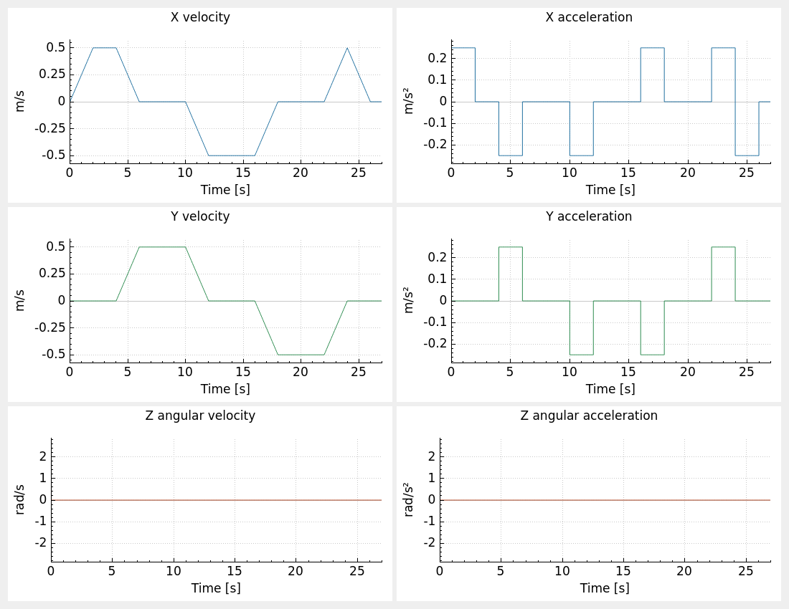
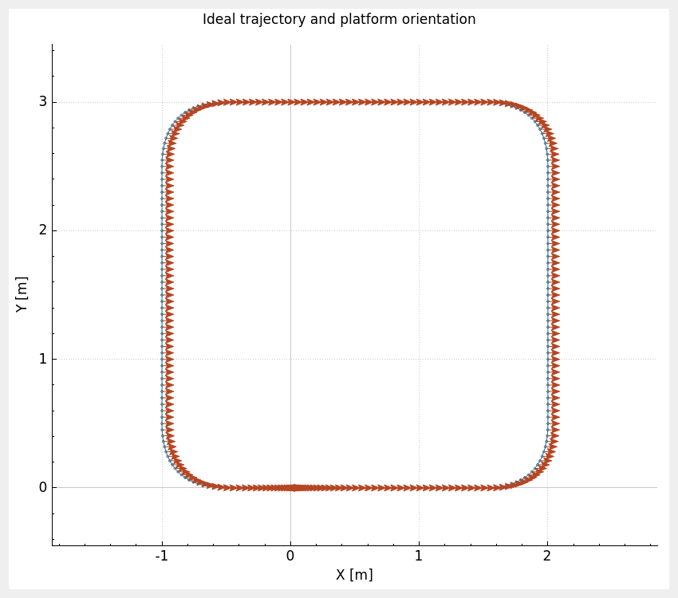

# ground_vehicle_motion_tester

`ground_vehicle_motion_tester` is a ROS 2 package for defining ground vehicle motion tests through velocity profiles stored in YAML. It includes a profile validator, a standalone desktop plotter, and a ROS executor that publishes the configured velocity commands. The plotter receives the YAML file path as a terminal argument and acts as a visual debugger by showing the velocity and acceleration profiles and reconstructing the ideal trajectory the platform would follow if it executed them.

Use it to prepare tests such as forward/reverse motion, lateral movement, rotation, or combinations of them by editing a configuration file. Each test describes how velocities change over time.

The validator detects incorrect fields, exceeded velocity or acceleration bounds, transitions that cannot finish within the requested duration, and discontinuities between movements. The complete test is checked before its preview is displayed or its commands are published. The plotter shows the commanded velocities and accelerations together with the ideal trajectory and the platform orientation at every plotted point; the executor reproduces the same profiles over time.

## Resources

- The profile validator checks the YAML fields, velocity and acceleration limits, movement durations, and continuity before a test is previewed or executed.
- `ground_vehicle_motion_plotter` previews the velocity and acceleration profiles and the ideal trajectory in a standalone Qt desktop application.
- `ground_vehicle_motion_executor_node` publishes the configured velocity commands in ROS 2. [launch/ground_vehicle_motion_executor.launch.py](launch/ground_vehicle_motion_executor.launch.py) starts it with an executor parameter file and a robot namespace.
- The [example profiles](#1-define-your-test) provide straight, lateral, diagonal, rotational, circular, and square motion tests. [config/example_executor_params.yaml](config/example_executor_params.yaml) configures the ROS executor.
- [doc/design.md](doc/design.md) describes the design and the complete YAML profile contract, while [deps.repos](deps.repos) lists the pinned source dependencies.

## Installation

Set `WORKSPACE` to your ROS 2 workspace path and clone this package into `${WORKSPACE}/ground_vehicle_motion_tester`. Its source dependencies `ground_vehicle_twist_odometry` and `ros2_launch_helpers` are pinned in [deps.repos](deps.repos). Import them into the same workspace before installing system dependencies through `rosdep`.

```bash
export WORKSPACE=<path-to-your-workspace>
mkdir -p "${WORKSPACE}"
git clone https://github.com/jfrascon/ground_vehicle_motion_tester.git "${WORKSPACE}/ground_vehicle_motion_tester"
vcs import "${WORKSPACE}" < "${WORKSPACE}/ground_vehicle_motion_tester/deps.repos"
source /opt/ros/jazzy/setup.bash
rosdep install --from-paths "${WORKSPACE}" --ignore-src -r -y
```

`package.xml` declares yaml-cpp, Qt 5, QCustomPlot, and the odometry package. `rosdep` installs the system libraries and skips dependencies supplied as source packages in the workspace.

## Build

Build the package and its source dependencies from the workspace root.

```bash
cd "${WORKSPACE}"
source /opt/ros/jazzy/setup.bash
colcon build --merge-install --packages-up-to ground_vehicle_motion_tester
source install/setup.bash
```

## Usage

Run the following commands from the workspace root after building and sourcing `install/setup.bash`.

### 1. Define your test

Start from [config/example_rounded_corner_square_constant_orientation.yaml](config/example_rounded_corner_square_constant_orientation.yaml). Set your platform's absolute velocity and acceleration bounds in `limits`, then edit the ordered movements in `profiles`:

- `T` defines the movement duration in seconds, shared by all axes.
- `x` and `y` define linear acceleration `a` and velocities `v_init` and `v_end`.
- `z` defines angular acceleration `alpha` and velocities `w_init` and `w_end`.

Use m/s and m/s² for linear motion, and rad/s and rad/s² for angular motion. Choose an acceleration that reaches the target within `T`; the target velocity is then held for the rest of the movement. For constant motion, set equal initial and final velocities and zero acceleration. Match each final velocity to the next movement's initial velocity.

See the [complete YAML format](doc/design.md#profile-file-contract) for the required fields.

The following example configurations start and finish at rest and include a final one-second hold at zero velocity so the executor publishes zero before completing. Straight and lateral tests use a cruising speed of 0.5 m/s and acceleration magnitude of 0.25 m/s². Combined tests also include a one-second stop before reversing. Diagonal tests use approximately 0.3536 m/s on each active axis, giving a resultant speed of 0.5 m/s.

Lateral, diagonal, and constant-orientation square examples are intended for omnidirectional platforms.

| Configuration | Movement | Duration |
| --- | --- | --- |
| [example_straight_forward.yaml](config/example_straight_forward.yaml) | X forward, then stop; 2 m ideal displacement | 7 s |
| [example_straight_backward.yaml](config/example_straight_backward.yaml) | X backward, then stop; −2 m ideal displacement | 7 s |
| [example_forward_stop_backward.yaml](config/example_forward_stop_backward.yaml) | X forward, stop, backward, stop; return to origin | 14 s |
| [example_lateral_y_positive.yaml](config/example_lateral_y_positive.yaml) | Positive Y translation, then stop; 2 m ideal displacement | 7 s |
| [example_lateral_y_negative.yaml](config/example_lateral_y_negative.yaml) | Negative Y translation, then stop; −2 m ideal displacement | 7 s |
| [example_lateral_y_positive_stop_negative.yaml](config/example_lateral_y_positive_stop_negative.yaml) | Positive Y, stop, negative Y, stop; return to origin | 14 s |
| [example_diagonal_x_positive_y_positive.yaml](config/example_diagonal_x_positive_y_positive.yaml) | X+/Y+ diagonal at 45°, then stop; 2 m ideal travel | 7 s |
| [example_diagonal_x_negative_y_negative.yaml](config/example_diagonal_x_negative_y_negative.yaml) | X−/Y− diagonal, then stop; 2 m ideal travel | 7 s |
| [example_rotation_z_positive.yaml](config/example_rotation_z_positive.yaml) | Positive 90° yaw rotation, then stop | ≈5.142 s |
| [example_circular_x_positive_wz_positive.yaml](config/example_circular_x_positive_wz_positive.yaml) | Complete counterclockwise circle, radius 1 m, then stop | ≈15.566 s |
| [example_rounded_corner_square.yaml](config/example_rounded_corner_square.yaml) | Closed square with rounded corners, four 90° left turns, then stop | ≈21.283 s |
| [example_rounded_corner_square_constant_orientation.yaml](config/example_rounded_corner_square_constant_orientation.yaml) | Closed square with rounded corners, constant orientation, forward/backward and lateral motion, then stop | 27 s |

The circular example uses `vx = 0.5 m/s` and `wz = 0.5 rad/s` at cruising speed. Their ratio remains 1 m during both acceleration and deceleration, preserving the circular path throughout the test.

### 2. Preview the test from the terminal

After building and sourcing `install/setup.bash`, run the following command.

```bash
ground_vehicle_motion_plotter ground_vehicle_motion_tester/config/example_rounded_corner_square_constant_orientation.yaml
```

This omnidirectional example starts at rest, follows a square with rounded corners, and returns to its starting position while keeping its orientation constant throughout. It combines forward, backward, and lateral motion with zero yaw rate. The straight portions are 2 m long; each corner changes both linear velocities with constant accelerations, producing a parabolic curve. Speed is 0.5 m/s on the straight portions and decreases to approximately 0.354 m/s midway through each corner. The last second holds the platform at rest.

Replace the example path with your profile YAML. The program checks the complete file before opening two windows:

- The velocities and accelerations window shows three rows for X, Y, and yaw, with velocity on the left and acceleration on the right.
- The ideal trajectory window shows positions in the XY plane with an orientation arrow at every plotted point.

The example command above produces these figures.





Drag a graph to pan and use the mouse wheel to zoom. Close both windows to exit. The program runs as a Qt desktop application. It requires a graphical session to display the figures.

```bash
ground_vehicle_motion_plotter --help
```

If validation fails, the program reports the file and failing field in the terminal. Profile indices in diagnostics start at zero.

### 3. Execute the test in ROS 2

The executor publishes `geometry_msgs/msg/Twist` commands. Launch the default forward test at 50 Hz in the robot namespace.

```bash
ros2 launch ground_vehicle_motion_tester ground_vehicle_motion_executor.launch.py namespace:=robot
```

This selects [config/example_executor_params.yaml](config/example_executor_params.yaml), which names the profile YAML and configures the sampling/publication rate. To select another profile, set `profile_file` in your executor parameter YAML and pass that file through `params_file`. The following example uses your parameter file and the simulator clock.

```bash
ros2 launch ground_vehicle_motion_tester ground_vehicle_motion_executor.launch.py \
  namespace:=robot \
  params_file:=/absolute/path/to/executor_params.yaml \
  use_sim_time:=true
```

| Parameter | Default | Meaning |
| --- | --- | --- |
| `profile_file` | Installed forward-test YAML | Standalone profile file loaded before publishing |
| `frequency` | `50.0` | Sampling and publication frequency in Hz |
| `use_sim_time` | `false` | Standard ROS clock selection; `true` follows `/clock` |

The executor reads `profile_file` and `frequency` at startup. Restart the node to change these settings.

The publisher uses the relative topic `cmd_vel`. The required `namespace` argument is the complete robot namespace, such as `/adapta/fl1`; this launch does not append a robot name. The caller can calculate it with `ros2_launch_helpers.SetRobotNamespace`. Select another destination through ROS remappings in `node_args`. The following example uses `myrobot` and publishes to `/myrobot/controller/cmd_vel`.

```bash
ros2 launch ground_vehicle_motion_tester ground_vehicle_motion_executor.launch.py \
  namespace:=myrobot \
  'node_args:={"output":"both","ros_arguments":["--log-level","info"],"remappings":[["cmd_vel","controller/cmd_vel"]]}'
```

When running the executable directly, use `-r cmd_vel:=target_topic` after `--ros-args`.

The first timer callback establishes the test's time origin. A paused simulation clock pauses publication. If the clock moves backwards, samples are discarded until it reaches the last accepted timestamp; the test retains its origin and progress.

Publication stops when the configured sequence ends. The node remains running until you stop it, for example with Ctrl+C. Finishing or stopping the node does not add a stop command; configure the last profiles to reach and maintain zero if the robot should finish stopped. If a final deceleration reaches zero exactly at the sequence endpoint, that endpoint may never be published.

To run the node directly, use an executor parameter YAML containing a literal profile path.

```bash
ros2 run ground_vehicle_motion_tester ground_vehicle_motion_executor_node --ros-args \
  -r __ns:=/robot \
  --params-file /absolute/path/to/executor_params.yaml
```

## Tests

After building, run the tests from the workspace directory.

```bash
cd "${WORKSPACE}"
source /opt/ros/jazzy/setup.bash
source install/setup.bash
colcon test --merge-install --packages-select ground_vehicle_motion_tester
colcon test-result --verbose --test-result-base build/ground_vehicle_motion_tester
```
