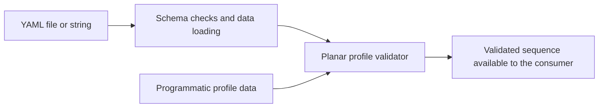

# Design and profile contract

This document describes the C++ validation and preview components. For practical setup and usage,
see the [user guide](../README.md).

## Components and responsibilities

`profile.hpp` defines general data types for linear and angular motion on each axis.
`AxisProfile` contains both transitions, `AxisLimits` contains their bounds, and `Profile`
groups X, Y, and Z under a common duration. `ProfileSequence` holds shared limits and the
ordered profiles. The data types themselves impose no ground vehicle restrictions.

The validator applies the planar ground vehicle model: X and Y use `a`, `v_init`, and `v_end`;
Z uses `alpha`, `w_init`, and `w_end`. Other components and their bounds must be zero.
It checks all limits and all profiles before returning successfully.

The YAML loader checks the document structure, field names, and numeric types, constructs
the general data model, and calls the same validator used for programmatic inputs.



| Exported CMake target | Responsibility | Dependencies |
| --- | --- | --- |
| `ground_vehicle_motion_tester::profile_core` | Validate profiles, prepare ramps, and sample the execution cursor | C++ standard library |
| `ground_vehicle_motion_tester::profile_yaml` | Load YAML and validate it | Profile core and yaml-cpp |
| `ground_vehicle_motion_tester::profile_preview` | Evaluate profiles and integrate ideal poses | Profile core and twist odometry library |

These libraries run without initializing ROS 2. The package uses ament for building and exporting
its installed CMake targets.

## Profile file contract

The profile file contains exactly one standalone YAML document with `limits` and `profiles`
at its root. It is separate from the ROS 2 node parameter file, which selects it through
`profile_file`.

Each of `limits.x`, `limits.y`, and `limits.z` is required:

| Axis | Required limits | Optional limits, only accepted as zero |
| --- | --- | --- |
| X, Y | `a_max_abs`, `v_max_abs` | `alpha_max_abs`, `w_max_abs` |
| Z | `alpha_max_abs`, `w_max_abs` | `a_max_abs`, `v_max_abs` |

Every profile requires `T`, `x`, `y`, and `z`:

| Axis | Required profile fields | Optional fields, only accepted as zero |
| --- | --- | --- |
| X, Y | `a`, `v_init`, `v_end` | `alpha`, `w_init`, `w_end` |
| Z | `alpha`, `w_init`, `w_end` | `a`, `v_init`, `v_end` |

Optional components default to zero. Required components must be supplied even when zero.
Numbers must be unquoted numeric scalars. Unknown fields, duplicate fields, nulls, strings,
booleans, multiple documents, and nonfinite values are rejected.

The conventional units are seconds, m/s, m/s², rad/s, and rad/s².
YAML `T` populates the C++ `Profile::duration` member.

## Motion and numeric rules

`T` is positive and shared by all components in a profile. Each active component starts its
transition at the beginning of the profile. For changing linear velocity:

```text
T_acc = (v_end - v_init) / a
v(t) = v_init + a * t    for 0 <= t < T_acc
v(t) = v_end            for T_acc <= t <= T
```

`a` must be nonzero, have the correct sign, and produce `0 < T_acc <= T`.
Equal endpoints require zero acceleration and describe constant motion throughout `T`.
The same rules apply to `alpha`, `w_init`, and `w_end` in Z.
Different axes can reach their targets at different times within the same profile.

Limits are finite and nonnegative. The absolute acceleration and both velocity endpoints
must be less than or equal to their respective limits. Since each ramp is monotonic, checking
both endpoints covers its velocity bound. Zero limits are valid.

The sequence contains at least one profile. Each consecutive pair must satisfy:

```text
previous.x.v_end == next.x.v_init
previous.y.v_end == next.y.v_init
previous.z.w_end == next.z.w_init
```

Continuity permits an absolute difference of `1e-9` in the respective velocity unit.
The transition-time comparison permits a relative excess of at most
`32 * std::numeric_limits<double>::epsilon()` to cover rounding at `T_acc = T`.
Limits and zero-only components are checked directly, without a tolerance.

Initial and final sequence velocities may be nonzero. Acceleration continuity is not required.
The validator checks components independently. The profile designer is responsible for the
physical feasibility of simultaneous commands on the wheels, modules, and controller.

## Public API and failure handling

`validate_profile_sequence()` validates a supplied `ProfileSequence` without modifying it.
`load_profile_yaml()` parses and validates a string. `load_profile_file()` reads a file and
uses the same loading and validation path. Both loaders return only after the full sequence
has passed every check.

The first failure throws `std::invalid_argument` with the field path and failed rule.
Profile indices start at zero. File access and read failures
use the same exception type, and errors from the file loader include the supplied file path.
Consumers can catch `std::invalid_argument` to handle these failures.

Returned sequences are ordinary mutable data. Consumers that modify them must validate
them again before using them.

A consumer can validate its configuration while initializing a member:

```cpp
#include "ground_vehicle_motion_tester/profile_yaml.hpp"

class ProfileConsumer
{
  public:
    /** @brief Construct only after the complete profile file passes validation. */
    explicit ProfileConsumer(const std::string& profile_file)
    : profiles_{ground_vehicle_motion_tester::load_profile_file(profile_file)}
    {
    }

  private:
    ground_vehicle_motion_tester::ProfileSequence profiles_;
};
```

If loading fails, construction stops before the consumer can use an invalid configuration.
The executor and preview application can use this same initialization pattern.

## Shared prepared program

`ProfileProgram` validates and copies the full sequence into owned `PreparedProfile` values.
Each interval stores its accumulated start/end times and three `PreparedTransition` values.
The local straight-line slope is the configured acceleration; its intercept is the initial
velocity. Preparation computes every ramp duration and completion timestamp once.
Constant velocity has a zero ramp duration and never divides by zero.

The evaluator receives the selected index and one relative nanosecond timestamp.
Both phase selection and velocity interpolation use that timestamp. It subtracts the profile's
integer start timestamp before converting local elapsed time to seconds, preserving short-ramp
precision even after a long earlier profile. Profile and ramp deadlines share the same rounded
nanosecond clock. Interpolated velocities remain bounded by their initial and final values.
The preview retains the configured event times in seconds for display while evaluating motion
on this same clock. Evaluation performs no file loading, validation, or transition-time division.

Validation, program preparation, and execution remain separate classes in the `profile_core`
library. The YAML and preview libraries add their own dependencies without coupling the core to
ROS, Qt, YAML parsing, or odometry.

## ROS executor

`ground_vehicle_motion_executor_node` wraps the shared evaluator with a ROS publisher and timer.
The constructor loads the profile YAML and prepares the program before creating command-related
ROS entities. The profile file and frequency parameters are read-only after startup.
Launch selects the executor parameter YAML through `params_file`; that YAML supplies
`profile_file` and `frequency`.
The publisher uses `geometry_msgs/msg/Twist`, the relative topic `cmd_vel`, and queue depth one.
ROS remappings select its destination; launch accepts them through the `node_args` JSON object.
Unused linear/angular message components remain zero.

`rclcpp::create_timer` uses the same `get_clock()` object sampled by the callback. The code does
not select a separate hardware clock: ROS manages system time and `/clock` through use_sim_time.
The callback reads one timestamp and passes it to `ProfileExecution`, which establishes t0 on
its first accepted call. Integer subtraction precedes conversion of elapsed time to seconds.

Intervals are half-open: `[start, end)`. A `size_t` cursor advances while elapsed time has reached
the current end, so one delayed callback can skip multiple expired intervals. Only the current
command is published; missed samples are not replayed. The frequency is a scheduling target,
not a hard real-time guarantee.

If a timestamp precedes the last accepted timestamp, the cursor returns no command and preserves
the origin, index, and last accepted time. Further old samples are also discarded until the
clock catches up. This condition does not abort or restart the test. The ROS adapter reports the
condition once and resumes normal sampling after recovery.

Completion returns no command and cancels the timer. It never injects zero or a final endpoint
publication. The node stays alive until normal ROS shutdown. A deceleration ending exactly at
the last interval boundary can therefore miss its zero target in the sampled command stream.
Stopped examples include a one-second final zero hold to provide zero commands before
completion. Arbitrary profiles may still finish at nonzero velocity.

Tests cover profile boundaries, independent ramps, delayed callbacks, backwards discard and
recovery, owned preparation data, large integer timestamp spans, and terminal behavior.
ROS integration tests observe real Twist publications with both normal and controlled ROS
clocks, including simulation pause, rewind, recovery, and cancellation at completion.

## Standalone plotter

`ground_vehicle_motion_plotter PROFILE.yaml` is a terminal-invoked Qt 5 application.
Its main function loads the YAML and constructs `ProfilePreview` before creating `QApplication`.
Profile and numerical errors can therefore be reported before a graphical display is needed.

`ProfilePreview` prepares a shared `ProfileProgram` and produces immutable `PreviewSample`
data. `PlotterFigures` receives these data and only handles their graphical presentation.
The executable is installed under `bin/` and requires no ROS initialization or launch file.

Regular plot samples are separated by 100 ms by default. Profile boundaries and each component's
ramp completion are also included, even when they fall outside that regular grid.
Acceleration is evaluated on the right side of a transition and drawn using duplicate event
times to show vertical changes. Velocities keep their configured final values at the last point.

The reusable `ground_vehicle_twist_odometry::twist_odometry` library integrates from the initial
pose `(0, 0, 0)` using commanded body-frame `vx`, `vy`, and `wz`. Internal integration intervals
are at most 10 ms and are split at every motion event. The library uses the average twist over
each interval; this is a numerical ideal trajectory, not an exact analytic solution for every
time-varying combination. Displayed point separation does not increase that integration step.
Preview times must fit the library's signed nanosecond clock, with distinct profile intervals.

The signal figure uses six QCustomPlot widgets in a Qt grid: X, Y, and yaw occupy rows 1, 2, and 3;
velocities occupy column 1 and accelerations column 2. All start with the same time range.
The XY figure uses a time-parameterized `QCPCurve` so reversals and loops keep their temporal order.
Each displayed point receives an equal-length arrow in direction `(cos(theta), sin(theta))`.
The XY axes use equal physical scales to preserve distances and orientations.
The plot stores the requested view separately from the ranges fitted to the window shape.
Resizing therefore preserves the view without cumulative range expansion, and zooming or
dragging replaces the requested view with the user's new selection.

The preview tests compare straight, lateral, and circular movements with analytical results.
Offscreen Qt tests check the grid, acceleration steps, path order, equal scales, repeated resize
cycles with zoom and pan, and one correctly oriented arrow per point. They render both figures
from the constant-orientation square YAML example for review.

## Source layout

- `include/ground_vehicle_motion_tester/`: public data types, validator, and YAML loader.
- `src/`: library implementations.
- `src/profile_plotter.cpp` and `src/profile_plotter_main.cpp`: Qt figures and terminal entry point.
- `src/profile_executor_ros.cpp` and `src/profile_executor_main.cpp`: ROS adapter and node entry.
- `test/`: mathematical and YAML contract tests.
- `config/example_rounded_corner_square.yaml`: a complete valid sequence.
- `launch/`: profile executor launch entry point.
- Root tooling files follow the conventions of `ground_vehicle_twist_odometry`.

The tests cover permitted transitions, numeric boundaries, forbidden components, continuity,
schema mistakes, and file errors. The example is loaded in a test to keep its configuration
consistent with the supported contract.

## Plotting references

- [Qt 5 top-level window example](https://doc.qt.io/archives/qt-5.15/qtwidgets-tutorials-widgets-toplevel-example.html).
- [QCustomPlot parametric curves](https://www.qcustomplot.com/documentation/classQCPCurve.html).
- [QCustomPlot line items](https://www.qcustomplot.com/documentation/classQCPItemLine.html).
